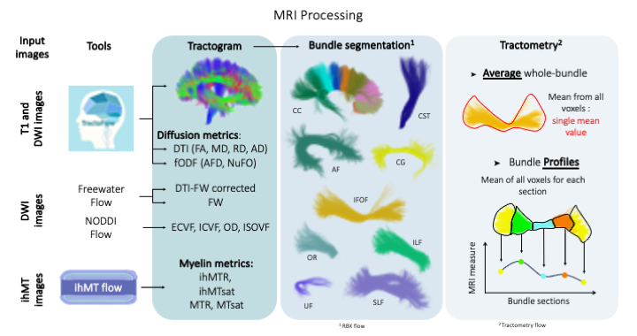

Configuration test
===========================

As part of the initial set up for your Read the Docs site,.
The configuration file tells Read the Docs what specific settings to use for your project.

This tutorial covers:

   Test file png figure.

Version html figure test.

.. raw:: html
  :file: ../data/AF/AF_volume_profile.html

Where to put your configuration file
------------------------------------

The file should be placed in the top-most directory of your project's repository.
We will get to the contents of the file in the next steps.

Getting started with a template
-------------------------------

Here are some configuration file examples to help you get started.

.. tabs::

    .. tab:: Sphinx

        If your project uses Sphinx,
        we offer a special builder optimized for Sphinx projects.

        .. figure:: ../pipeline/pipelines.png
          :align: center
          :width: 700

    .. tab:: MkDocs

        If your project uses MkDocs,
        we offer a special builder optimized for MkDocs projects.

        .. raw:: html
          :file: ../data/AF/AF_volume_profile.html

Editing the template
--------------------

Now that you have a ``.readthedocs.yaml`` file added to your Git repository,
you should see Read the Docs trying to build your project with the configuration file.
The configuration file probably needs some adjustments to accommodate exactly your project setup.

   Test file png figure.

Version html figure test.

.. raw:: html
  :file: ../data/AF/AF_volume_profile.html

Skip: file header and comments
~~~~~~~~~~~~~~~~~~~~~~~~~~~~~~

There are some parts of the templates that you can leave in place:

Comments
  We added comments that explain the configuration options and optional features.

Commented out features
  which you can choose to enable, delete or save for later.

Adjust: 
~~~~~~~~~~~~~~~~~~~~

In our examples,
we are using Read the Docs' custom image based on the latest Ubuntu release.
Package versions in these images will not change drastically,
though will receive periodic security updates.

You should pay attention to this field if your project needs to build on an older version of Ubuntu,
or in the future when you need features from a newer Ubuntu.

.. seealso::

   toto is tata and not titi.

Adjust: Python configuration
~~~~~~~~~~~~~~~~~~~~~~~~~~~~

If you are using Python in your builds,

Adjust: Sphinx and MkDocs version
~~~~~~~~~~~~~~~~~~~~~~~~~~~~~~~~~

But we recommend that you specify the version that your documentation project uses.
The lists the Python packages you want Read the Docs to install.
