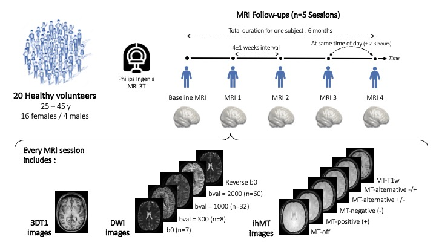

Data collection
===============

Imaging Protocol
-----------------

Twenty healthy adults (mean age 36 years, age range 29-46 y.o.(SD = 4.7),
4 men and 17 women) were scan at the Centre Hospitalier Universitaire
of Sherbrooke (CHUS) using a clinical 3T MRI scanner (Ingenia, Philips
Healthcare, Best, Netherlands) with a 32-channel head coil.

For each participant, images were acquired at approximately the same time of day 
to avoid potential diurnal effects (i.e., a morning participant had all sessions in the morning, 
with a tolerated 2–3-hour variation). 

   3DT1 - Anatomical 3D T1-weighted, DWI - Diffusion weighted Images, reverse b0 - Reverse phase encoding B0, ihMT - inhomogeneous magnetization transfer

MRI acquisition parameters
---------------------------

+--------------------------------+-------------+-------------+-------------+----------------+----------------+
|    Parameters / Sequences      |      T1     |     DWI     |  Reverse B0 |      ihMT      |     T1 ihMT    |
+================================+=============+=============+=============+================+================+
|    Phase-encoding direction*   |      RL     |     PA      |      AP     |       RL       |       RL       | 
+--------------------------------+-------------+-------------+-------------+----------------+----------------+
| Technique - Fast imaging method|  FFE - TFE  |   SE - EPI  |  SE - EPI   |    FFE - EPI   |    FFE - EPI   |
+--------------------------------+-------------+-------------+-------------+----------------+----------------+
|     Total scan duration        |  4 min 20s  |  9 min 20s  |     14s     |   6 min 04 s   |      13 s      |
+--------------------------------+-------------+-------------+-------------+----------------+----------------+
|   Repetition time (TR, ms)     |     7.9     |     4800    |    4800     |       112      |       20       |
+--------------------------------+-------------+-------------+-------------+----------------+----------------+
|      Echo Time (TE, ms)        |     3.5     |      92     |     92      |   3.6 (Δ = 6)  |   3.6 (Δ = 6)  |  
+--------------------------------+-------------+-------------+-------------+----------------+----------------+
|     Inversion Time (TI, ms)    |     950     |             |             |                |                |
+--------------------------------+-------------+-------------+-------------+----------------+----------------+
|        Flip Angle (degree)     |      8      |      90     |      90     |       15       |       30       |
+--------------------------------+-------------+-------------+-------------+----------------+----------------+
|     Field of View (FOV, mm)    |  224 x 224  |  224 x 224  |  224 x 224  |   224 x 224    |   224 x 224    |
+--------------------------------+-------------+-------------+-------------+----------------+----------------+
|           Slices (n)           |     150     |      66     |      66     |       65       |       65       |
+--------------------------------+-------------+-------------+-------------+----------------+----------------+
|        Voxel size (mm)         |  1 x 1 x 1  |  2 x 2 x 2  |  2 x 2 x 2  |   2 x 2 x 2    |   2 x 2 x 2    |
+--------------------------------+-------------+-------------+-------------+----------------+----------------+
|                                |             |7, 300 (8),  |             |                |                |
|  n b0, b-value (n directions)  |             |1000 (32),   |             |                |                |
|                                |             |2000 (60)    |             |                |                |
+--------------------------------+-------------+-------------+-------------+----------------+----------------+
|                                |             |             |             | 10 Hann pulses |                |
|                                |             |             |             | of. 0.9 ms     |                | 
|      MT stauration pulse       |             |             |             | duration with  |                |
|                                |             |             |             | 1.5 ms interval|                |
+--------------------------------+-------------+-------------+-------------+----------------+----------------+
|     Frequency offset of +/-    |             |             |             |     7000 Hz    |                | 
+--------------------------------+-------------+-------------+-------------+----------------+----------------+
|    n Echoes - Echo spacing     |             |             |             |                |    3 - 6 ms    |
+--------------------------------+-------------+-------------+-------------+----------------+----------------+
*The directions are specified in coordinates of the patient (LPH).

All MRI data acquisitions were aligned on the anterior commissure-posterior commissure plan (AC-PC)

An example of bvec and bval file for DWI can be downloaded here:

 :download:`bval bvec files<../download/bval_bvec_files.zip>`

Data conversion: DICOM to BIDS
------------------------------

To convert data we use `BIDS`_.
An example of the data structure for one subject is shown below:

::

    data-subject
    ├── dataset_description.json
    ├── participants.json
    ├── participants.tsv
    ├── sub-001_ses-1
    ├── sub-001_ses-2
    ├── sub-001_ses-3
    ├── sub-001_ses-4
    ├── sub-001_ses-5
    ├── sub-002_ses-1
    ├── ...
    ├── sub-003_ses-1
        │
        ├── anat
        │   ├── sub-003-1_T1w.json
        │   ├── sub-003-1_T1w.nii.gz
        │   ├── sub-003-1_acq-pos_ihmt.json
        │   ├── sub-003-1_acq-pos_ihmt.nii.gz
        │   ├── sub-003-1_acq-neg_ihmt.json
        │   ├── sub-003-1_acq-neg_ihmt.nii.gz
        │   ├── sub-003-1_acq-altnp_ihmt.json
        │   ├── sub-003-1_acq-altnp_ihmt.nii.gz
        │   ├── sub-003-1_acq-altpn_ihmt.json
        │   ├── sub-003-1_acq-altpn_ihmt.nii.gz
        │   ├── sub-003-1_acq-T1w_ihmt.json
        │   └── sub-003-1_acq-T1w_ihmt.nii.gz
        │
        └── dwi
            ├── sub-003-1_dwi.bval
            ├── sub-003-1_dwi.bvec
            ├── sub-003-1_dwi.json
            ├── sub-003-1_dwi.nii.gz
            ├── sub-003-1_b0.json
            ├── sub-003-1_b0.nii.gz
            ├── sub-003-1_rev-b0.json
            └── sub-003-1_rev-b0.nii.gz

To convert our DICOM data folder to the compatible BIDS structure, we used
`dcm2bids`_.

.. code-block:: bash

  dcm2bids -d DICOM_folder -p id_subject -c config.txt -o sub-id

Quality Control raw data
------------------------

Quality control of raw data was performed using DMRIQC flow `DMRI QC Flow`_.

Example of datasets for one subject
-----------------------------------

** Anatomical image **

+---------------------------------+
|              3D-T1w             | 
+=================================+
| .. image:: 3DT1.png             |
|    :width: 200                  |
+---------------------------------+

** Diffusion images **

+----------------------------+----------------------------+----------------------------+----------------------------+----------------------------+
|        DWI - b0            |    DWI - b value = 300     |    DWI - b value = 1000    |    DWI - b value = 2000    |      DWI - Reverse B0      |
+============================+============================+============================+============================+============================+
| .. image:: dwiB0.png       |  .. image:: b300.gif       | .. image:: b1000.gif       | .. image:: b2000.gif       | .. image:: revB0.png       |
|    :width: 200             |    :width: 200             |    :width: 200             |    :width: 200             |    :width: 200             |
+----------------------------+----------------------------+----------------------------+----------------------------+----------------------------+

** ihMT images **

+--------------------------+-----------------------+-----------------------+-----------------------+-----------------------+----------------------+
|          MT-Off          |     Positive (pos)    |    Negative (neg)     |  Alternative pos-neg  | Alternative neg-pos   |      T1w ihMT        |
+==========================+=======================+=======================+=======================+=======================+======================+
| .. image:: ioff.png      | .. image:: ipos.png   |  .. image:: ineg.png  | .. image:: ialtpn.png | .. image:: ialtnp.png | .. image:: iT1w.png  |
|    :width: 200           |    :width: 200        |    :width: 200        |    :width: 200        |    :width: 200        |    :width: 200       |
+--------------------------+-----------------------+-----------------------+-----------------------+-----------------------+----------------------+

 .. _DMRI QC Flow: https://github.com/scilus/dmriqc_flow
 .. _dcm2bids: https://github.com/cbedetti/Dcm2Bids#install
 .. _BIDS: http://bids.neuroimaging.io/

