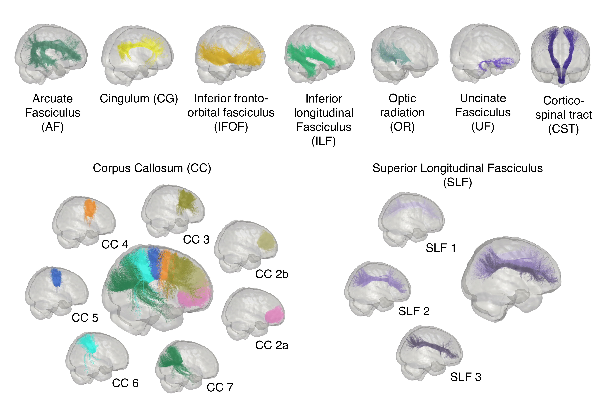

Bundles
=======

Bundles segmentation
--------------------

- For the segmentation of bundles we used `RecobundlesX <https://github.com/scilus/rbx_flow>`__

   Representation of the major white matter bundle models used by RecobundlesX as shape priors to extract the bundles from the whole tractogram. Bundles of both hemispheres are shown.

Bundles profiling
--------------------

- For the profiling bundles we used `Tractometry flow  <https://github.com/scilus/tractometry_flow>`__

.. figure:: bundles_profiling.png
   :align: center
   :width: 700

   Representation of  white matter major bundle models resampled  into 10 segments for illustration. Left and right have been merged. The colors displayed on the bundles represent the section numbers from 1 (blue) to 10 (red).

Streamlines metric generated
-----------------------------
Table describe all streamlines metrics which will be generated for each bundle.

+-----------------+-----------------------+
| Tools           | Streamline metrics    |
+=================+=======================+
| RBXflow         | Count                 |
+-----------------+-----------------------+
|                 | Volume                |
+-----------------+-----------------------+
|                 | Length                |
+-----------------+-----------------------+

