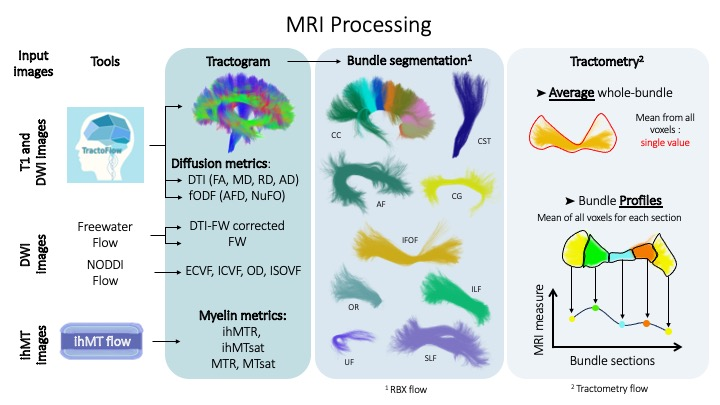

MRI Processing
=================

Tools
---------------

 - For DWI and T1 processing we used `Tractoflow <https://github.com/scilus/tractoflow>`__ and
 - For DWI processing we used `NODDI <https://github.com/scilus/noddi_flow>`__ and `FW <https://github.com/scilus/freewater_flow>`__
 - For ihMT processing we used `ihMTflow <https://github.com/scilus/ihmt_flow>`__

   Process and analysis overview. Various tools available in Scilpy are used to process 3DT1, DWI and ihMT images.
Tractoflow is used to process T1 and DWI images to generate tractograms and maps of diffusion measurements derived from the DTI and fODF model. Tractoflow outputs are used for Freewater flow to correct DWI and generate freewater-corrected measurement maps derived from the DTI model and the freewater map. Similarly, NODDI flow is used to generate the 4 microstructure maps calculated using the Amico model. In parallel, ihMT images are processed with ihMT flow to generate the 4 myelin maps (2 ratios and 2 saturations, i.e. corrected for T1 dependence).
From the tractogram generated by Tractoflow, the white matter bundles are segmented using RecoBundlesX.
Finally, from each bundle and the diffusion and myelin measurement maps, the mean value for the whole bundle and along the bundle are obtained using Tractometry flow.

Metrics generated
-----------------
Table describe all metrics maps which will be evaluated.

+-------------------------------+-------------------------------------------+
| Tools                         | Generated images                          |
+===============================+===========================================+
| Tractoflow - DTI              | Fractional anisotropy (FA)                |
+-------------------------------+--------------------+----------------------+
|                               | Mean Diffusivity (MD)                     |
+-------------------------------+--------------------+----------------------+
|                               | Radial Diffusivity (AD)                   |
+-------------------------------+--------------------+----------------------+
|                               | Axial Diffusivity (AD)                    |
+-------------------------------+--------------------+----------------------+
| Tractoflow - DTI-FW corrected | Fractional anisotropy tissue (FAt)        |
+-------------------------------+--------------------+----------------------+
|                               | Mean Diffusivity tissue (MDt)             |
+-------------------------------+--------------------+----------------------+
|                               | Radial Diffusivity tissue (ADt)           |
+-------------------------------+--------------------+----------------------+
|                               | Axial Diffusivity tissue (ADt)            |
+-------------------------------+--------------------+----------------------+
| Tractoflow - FW               | Free water (FW)                           |
+-------------------------------+--------------------+----------------------+
| Tractoflow - FODF             | Apparent fiber density total (AFD total)  |
+-------------------------------+--------------------+----------------------+
|                               | Number of fober direction (NuFO)          |
+-------------------------------+--------------------+----------------------+
| NODDI flow                    | Intra-cellular volume fraction (ICvf)     |
+-------------------------------+--------------------+----------------------+
|                               | Extra-cellular volume fraction (ECvf)     |
+-------------------------------+--------------------+----------------------+
|                               | Isotropic volume fraction (ISOvf)         |
+-------------------------------+--------------------+----------------------+
|                               | Orientation direction (OD)                |
+-------------------------------+--------------------+----------------------+
| ihMT flow                     | ihMT ratio (ihMTR)                        |
+-------------------------------+--------------------+----------------------+
|                               | ihMT delta R1 saturation (ihMTsat)        |
+-------------------------------+--------------------+----------------------+
|                               | MT ratio (MTR)                            |
+-------------------------------+--------------------+----------------------+
|                               | MT saturation (MTsat)                     |
+-------------------------------+--------------------+----------------------+

Quality Control
---------------
The visual quality assessment procedure was applied to the main steps according to the following criteria (using `DMRI QC <https://github.com/scilus/dmriqc_flow>`__):

+------------------+---------------------+-------------------------------------------------------------------+
|   MRI images     |         Step        |                        Exclusion criteria                         |
+==================+=====================+===================================================================+
|  T1, MTI, DWI    |  Raw data           | Presence of artifacts that cannot be corrected,                   |
|                  |                     | Incorrect field of view, Incorrect distribution of gradient (DWI) |
|                  |                     | Too high noise in the image, High inhomogeneity (MTI),            |
|                  |                     | Broken image, Missing part of the brain (T1, MTI)                 |
+------------------+---------------------+-------------------------------------------------------------------+
|  T1, MTI, DWI    | Brain extraction    | Eyes included in the brain mask,                                  |
|                  |                     | Exclusion of a part of the brain,                                 |
|                  |                     | Inclusion of a large part of the background in the brain mask     |
+------------------+---------------------+-------------------------------------------------------------------+
|      DWI         | Motion correction   | Alteration of bvecs,                                              |
|                  |                     | Remaining motion in the DWI,                                      |
|                  |                     | Presence of slice drop (at least in one direction)                |
+------------------+---------------------+-------------------------------------------------------------------+
|      DWI         | RGB                 | Invalid orientation in major WM structures,                       |
|                  |                     | Low FA value in expected structure (Corpus callosum for example), |
|                  |                     | Global color bias (indicating remaining motion)                   |
+------------------+---------------------+-------------------------------------------------------------------+
|  T1, MTI, DWI    | Registration        | Poor overlap between warped images and reference image            |
+------------------+---------------------+-------------------------------------------------------------------+
|     T1, DWI      | Mask                | Presence of holes in mask,                                        |
|                  |                     | Some part of mask missing                                         |
+------------------+---------------------+-------------------------------------------------------------------+
|      DWI         | Bundle segmentation | Unexpected shape,                                                 |
|                  |                     | Ends of bundle not in expected locations and/or without expected  |
|                  |                     | fanning,                                                          |
|                  |                     | A low number of streamlines                                       |
+------------------+---------------------+-------------------------------------------------------------------+
|      DWI         | Tract-profile       | Unexpected number of sections,                                    |
|                  |                     | Unbalanced sections                                               |
+------------------+---------------------+-------------------------------------------------------------------+
|    MTI, DWI      | Metrics map         | Unexpected range of value (FA > 1 for example),                   |
|                  |                     | Unexpected range of value in expected structure (low FA value in  |
|                  |                     | Corpus callosum for example)                                      |
+------------------+---------------------+-------------------------------------------------------------------+

